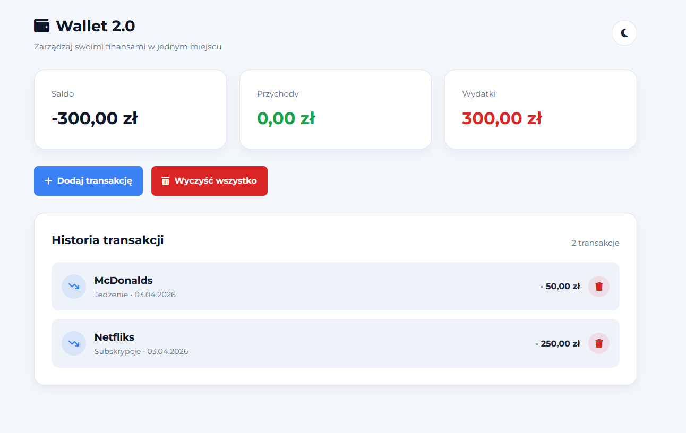
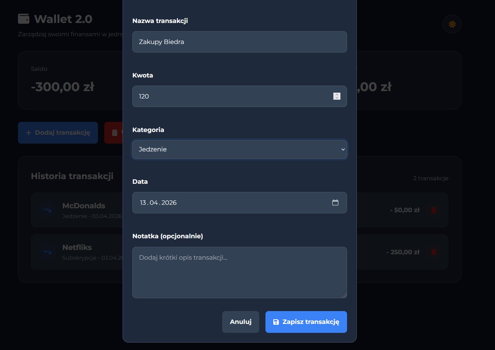

# Wallet 2.0

Wallet 2.0 is a personal finance web app built as a portfolio project for practicing frontend development with HTML, SCSS, and vanilla JavaScript.

The application allows users to manage income and expenses, track balance, categorize transactions, and store data locally in the browser.

## 🚀 [LIVE DEMO](https://serek0728.github.io/Wallet-2.0/)

## 📸 Preview
### Light mode

### Dark mode

## ✨ Features

- Add income and expense transactions
- Assign categories to transactions
- Real-time balance, income, and expense summary
- Transaction history rendering
- Delete single transactions
- Delete all transactions
- Form validation
- Modal-based transaction form
- Dark / Light mode toggle
- Data persistence with LocalStorage

## 🛠️ Tech Stack

- HTML5
- SCSS
- JavaScript (ES Modules)
- LocalStorage

## 🎯 Project Goal

The main goal of this project was to build a more realistic frontend application than a simple to-do or calculator app, while practicing:

component-like UI structure in plain HTML/CSS
modular JavaScript architecture
DOM manipulation
form handling and validation
local data persistence
UI state management

## 📌 Future Improvements

Potential future improvements:

transaction filtering
monthly summaries
charts / data visualization
editing existing transactions
recurring payments
export to CSV

## 👨‍💻 Author

Created as a frontend portfolio project by **serek0728**.
